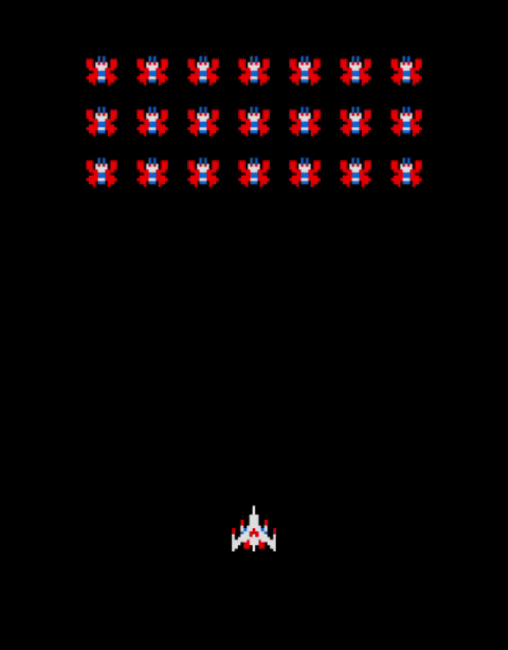

# jogl-log / galaga example
learning JOGL to hopefully make games using a game engine instead of JFrame / GraphicsProgram 

This project began as a game engine tutorial but then I decided to recreate the 2D game Galaga

